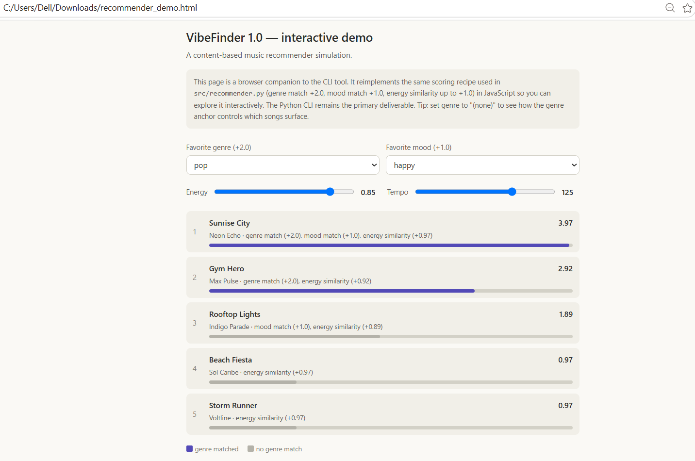

# 🎵 Music Recommender Simulation

## Project Summary

In this project you will build and explain a small music recommender system.

Your goal is to:

- Represent songs and a user "taste profile" as data
- Design a scoring rule that turns that data into recommendations
- Evaluate what your system gets right and wrong
- Reflect on how this mirrors real world AI recommenders

Replace this paragraph with your own summary of what your version does.

---

## How The System Works

Real-world recommenders connect large-scale user profiles and behavior signals to song metadata and audio-derived features so they can score each candidate quickly and surface the best matches. My simplified content-based system does the same thing on a small catalog by comparing a user’s taste profile directly to each song’s genre, mood, energy, and tempo, then ranking songs by how closely they match.

I do believe `energy` and `valence` together are a strong way to capture a song’s emotional vibe, but for this simple version I am choosing to keep only four features so the model stays easy to explain and implement. That means I am deliberately leaving out `valence`, `danceability`, and `acousticness` for now, even though they could add nuance later.

The scoring rule is:
- `genre`: exact match → 1.0, otherwise 0.0
- `mood`: exact match → 1.0, otherwise 0.0
- `energy`: closeness score = `max(0.0, 1.0 - abs(song.energy - user.preferred_energy))`
- `tempo`: closeness score normalized to BPM range = `max(0.0, 1.0 - abs(song.tempo_bpm - user.preferred_tempo) / 92)`

These are combined with the following weights:
- `genre`: 0.35
- `mood`: 0.20
- `energy`: 0.25
- `tempo`: 0.20

This means genre is the strongest anchor, while mood, energy, and tempo provide finer-grained vibe matching.

Expected bias note:
- Because genre is weighted highest and both genre and mood use exact matching, the system is likely to favor songs that stay inside one stylistic bucket and may under-recommend hybrid or underrepresented tracks.
- The design also makes the recommender less flexible for listeners who care more about production texture, emotional valence, or cross-genre discovery.

- `Song` attributes:
  - `genre`
  - `mood`
  - `energy`
  - `tempo_bpm`

- `UserProfile` attributes:
  - `preferred_genre`
  - `preferred_mood`
  - `preferred_energy`
  - `preferred_tempo`

---

## Getting Started

### Setup

1. Create a virtual environment (optional but recommended):

   ```bash
   python -m venv .venv
   source .venv/bin/activate      # Mac or Linux
   .venv\Scripts\activate         # Windows

2. Install dependencies

```bash
pip install -r requirements.txt
```

3. Run the app:

```bash
python -m src.main
```

### Running Tests

Run the starter tests with:

```bash
pytest
```

You can add more tests in `tests/test_recommender.py`.

---

## Sample Recommendation Output

Paste a sample of your recommender's output here as a text block so a reader can see what it produces:

```
Top 5 recommendations for: High-Energy Pop

Rank | Title | Artist | Score | Reasons
1 | Sunrise City | Neon Echo | 3.97 | genre match (+2.00), mood match (+1.0), energy similarity (+0.97)
2 | Gym Hero | Max Pulse | 2.92 | genre match (+2.00), energy similarity (+0.92)
3 | Rooftop Lights | Indigo Parade | 1.91 | mood match (+1.0), energy similarity (+0.91)
4 | Storm Runner | Voltline | 0.94 | energy similarity (+0.94)
5 | Night Drive Loop | Neon Echo | 0.90 | energy similarity (+0.90)
```

## Interactive Demo

For a hands-on version, download `recommender_demo.html` and open it in any
browser. Adjust the genre, mood, and energy controls to watch the top-5
recommendations re-rank live. It mirrors the same scoring recipe as the Python
CLI (genre +2.0, mood +1.0, energy up to +1.0).



---

## Experiments You Tried

Use this section to document the experiments you ran. For example:

- What happened when you changed the weight on genre from 2.0 to 0.5
- What happened when you added tempo or valence to the score
- How did your system behave for different types of users

---

## Limitations and Risks

Summarize some limitations of your recommender.

Examples:

- It only works on a tiny catalog
- It does not understand lyrics or language
- It might over favor one genre or mood

You will go deeper on this in your model card.

---

## Reflection

My biggest learning moment: Seeing firsthand how much a single variable can control an entire system. My exact-match genre weight was so strong that even when I ran an experiment to double the energy weight and halve the genre weight, the top results didn't even reorder themselves.

How AI helped vs. When I had to step in: The AI was incredibly helpful for writing the boilerplate code quickly, but I learned I couldn't trust it blindly. I had to catch real problems it introduced, like the from import Path bug, the mathematical risk of tempo not being normalized (which would have broken the 0-1 scale), and catching that it hallucinated 8 song rows that it never actually saved to my CSV.

What surprised me: I was surprised that just three simple math equations (adding and subtracting decimals based on absolute differences) could produce a sorted list of songs that genuinely feels like a curated, intentional recommendation.

What I'd try next: I would implement "soft" genre matching so that songs that are stylistically similar get partial points. I would also definitely add the danceability feature back into the algorithm, as that is a massive part of the Pop and Reggaeton music I personally listen to.

Read and complete `model_card.md`:

[**Model Card**](model_card.md)

Write 1 to 2 paragraphs here about what you learned:

- about how recommenders turn data into predictions
- about where bias or unfairness could show up in systems like this


